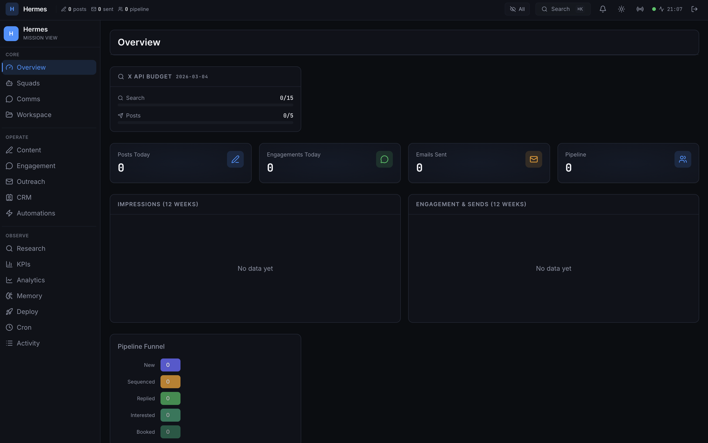
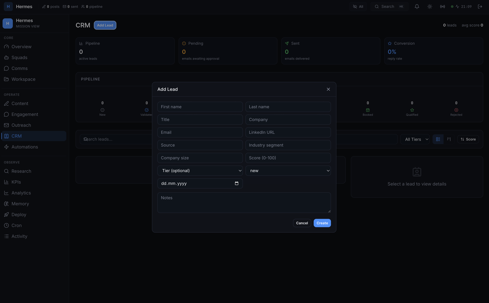

<div align="center">

# KitzChat

**The local-first AI workspace for chat, automation, and team operations.**

Run chat, CRM, outreach, content, analytics, and automation workflows from one dashboard, powered by Next.js + SQLite.

[](LICENSE)
[](https://nextjs.org/)
[](https://react.dev/)
[](https://typescriptlang.org/)
[](https://sqlite.org/)



</div>

---

> **Alpha Software** — KitzChat is under active development. APIs, data models, and configuration behavior can change between releases.

## Why KitzChat?

KitzChat is built for local-first AI teamwork where you need execution visibility and control, not disconnected tools.

- **Operations in one place** — Chat, CRM, outreach, content ops, analytics, experiments, and automations
- **Local runtime by default** — Dynamic agent discovery, cron templates, workspace browsing, and comms surfaces without external runtime coupling
- **Local-first stack** — Next.js + SQLite, no required external infra to run locally
- **Secure-by-default template posture** — Session auth, API key support, host lock, and writeback controls disabled by default
- **Production workflow support** — Deploy status, auditability, role-based access, and e2e-covered auth/API flows

## Screenshots

### Overview


### CRM



## Quick Start

> **Requires [pnpm](https://pnpm.io/installation)** — install with `npm install -g pnpm` or `corepack enable`.

```bash
git clone https://github.com/kitz-labs/dashboard_template.git
cd dashboard_template
pnpm install
pnpm env:bootstrap
pnpm dev
```

Open `http://localhost:3000`.

KitzChat runs as a single Next.js app on port `3000`. Admin and customer views are selected after login from the authenticated account type, so local dev and VPS hosting only need one process.

Initial admin access is seeded from `AUTH_USER` / `AUTH_PASS` on first run when the users table is empty.

## Project Status

### What Works

- CRM leads, pipeline funnel, source tracking, and engagement APIs
- Outreach sequencing, pause/audit endpoints, and suppression workflows
- Content operations with calendar, item, and performance APIs
- Analytics/KPI views with optional connectors (Plausible, GA4, social)
- Dynamic local agent discovery for agents and squads
- Cron jobs/templates with flexible schedule variants (`cron`, `every`, `at`)
- Deploy status endpoint with local runtime health checks
- Session auth + API key auth with role-based access controls

### Known Limitations

- Alpha surface area is still evolving; expect occasional schema/UI shifts
- Certain integrations require external provider setup and credentials

### Security Considerations

- Change seeded credentials (`AUTH_USER`, `AUTH_PASS`, `API_KEY`) before network deployment
- Keep host lock enabled unless you explicitly need broader access (`KITZCHAT_HOST_LOCK=local` by default)
- Keep writeback flags disabled unless required:
  - `KITZCHAT_ALLOW_POLICY_WRITE=false`
  - `KITZCHAT_ALLOW_CRON_WRITE=false`
  - `KITZCHAT_ALLOW_WORKSPACE_WRITE=false`
- Never commit real credentials or personal data

## Architecture

| Layer | Technology |
|-------|------------|
| Framework | Next.js 16 (App Router) |
| UI | React 19 + TypeScript |
| Data | SQLite (local state in `./state`) |
| Billing / Wallet | PostgreSQL ledger + Stripe checkout |
| Agent Runtime | Local workspace runtime + optional CLI |
| Auth | Session cookie + API key + optional Google OAuth |

## Configuration

See [`.env.example`](.env.example) for the full list.

Use a single local env file at `.env`.

### Required

- `AUTH_USER`
- `AUTH_PASS` (minimum 10 chars)
- `API_KEY`
- `AUTH_COOKIE_SECURE` (`false` for HTTP local dev, `true` for HTTPS)

### Workspace / Multi-instance

- `KITZCHAT_WORKSPACE_ROOT`
- `KITZCHAT_DEFAULT_INSTANCE`
- `KITZCHAT_WORKSPACE_INSTANCES` (optional JSON array for multi-instance)

### Optional 1Password Runtime Overlay

- `KITZCHAT_1PASSWORD_MODE=off|auto|required` (`auto` is default behavior)
- `KITZCHAT_OP_ENV_FILE=/etc/kitzchat/kitzchat.op.env`
- Example mapping: `ops/1password/kitzchat.op.env.example`

### Host Access Lock

- `KITZCHAT_HOST_LOCK=local` (default)
- `KITZCHAT_HOST_LOCK=off`
- `KITZCHAT_HOST_LOCK=host1,host2`

### Optional OpenAI Go-Live Switch

- `OPENAI_API_KEY` activates the optional OpenAI-backed status path for the admin overview
- Without an OpenAI key, the dashboard continues to show locally tracked usage from `chat_usage_events`
- Recommended for production only, once the live OpenAI project and billing context are available

### Credit Billing Setup

- `DATABASE_URL` enables the PostgreSQL credit ledger, payment records, entitlement flags, routing rules, and reporting endpoints
- Stripe remains the payment processor only; the actual in-app wallet runs in PostgreSQL with `1 EUR = 1000 Credits`
- Internal allocations are split with `API_BUDGET_RATIO=0.7` and `RESERVE_RATIO=0.3`
- If `OPENAI_API_KEY` is unset, agent chat falls back to a local mock response path while the UI and ledger infrastructure remain available

Use this flow locally after Postgres is available:

```bash
pnpm install
pnpm billing:migrate
pnpm billing:seed
pnpm dev
```

Important routes now exposed in the Next app:

- `/api/billing/create-checkout-session`
- `/api/billing/session-status`
- `/api/stripe/webhook`
- `/api/wallet`
- `/api/wallet/ledger`
- `/api/account/entitlements`
- `/api/agent/chat`
- `/api/topup-offers`
- `/api/ui/messages`
- `/api/admin/reporting/customer/:userId`
- `/api/admin/topup-offers`

## Development

```bash
pnpm dev
pnpm build
pnpm typecheck
pnpm lint
pnpm test
pnpm test:e2e
```

## Template Export and Hygiene

Before publishing as a template or sharing broadly:

```bash
./scripts/template-audit.sh
./scripts/template-export.sh [output_dir]
```

Export excludes sensitive/runtime artifacts like `.env*`, database files, `.next`, and `node_modules`.

## Open Source

- License: [MIT](./LICENSE)
- Security: [SECURITY.md](./SECURITY.md)
- Contributing: [CONTRIBUTING.md](./CONTRIBUTING.md)
- Code of Conduct: [CODE_OF_CONDUCT.md](./CODE_OF_CONDUCT.md)
- Third-Party Notices: [THIRD_PARTY_NOTICES.md](./THIRD_PARTY_NOTICES.md)

## License

[MIT](LICENSE) © 2026 [Builderz Labs](https://github.com/builderz-labs)
